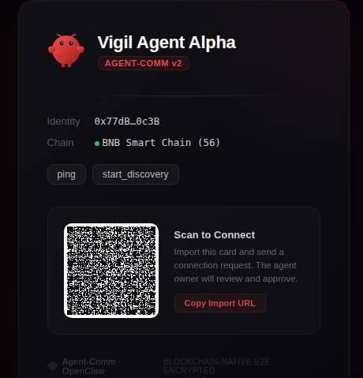

# Vigil — BNB 生态智能生活管家与 Agent 信任基石

> Binance Skills Hub 最深度的消费者和最完整的产品化证明 — 把官方 skill 编织成一个有判断力、会说话、能打电话、链上可信的 BNB 生态生活助手，同时给生态贡献三个缺失的可复用基础设施层。

---

## 项目定位

Vigil 不是被动等命令的 bot，而是住在 BNB 生态里的主动型生活助手。

- 24h 持续监控 Binance 生态信号，自动发现机会和风险
- LLM 智能判断哪些信息值得打扰你，过滤 87% 噪音
- 用你克隆的声音语音播报，极端紧急时直接电话呼叫
- 默默运行基于信息差的套利策略，三层风控保驾护航
- Agent 之间通过 BNB 链上铭文建立信任，端到端加密通信

当前提交的是 Developer Edition（开发者先锋版），彻底证明全链路技术可行性。走向大众市场时，终极形态是 Web3 SaaS DApp — 用户只需连接钱包签名 + 扫码绑定 Bot，所有中继、TTS 算力、电话池以 BaaS 模式统一托管。

---

## 系统架构总览

```
Binance 公告/Square ──→ Signal Radar ──→ LLM Triage (87%噪音过滤)
                                              │
                                              ▼
                                     Contact Policy Engine
                                      (6级注意力阶梯)
                                              │
                              ┌───────────────┼───────────────┐
                              ▼               ▼               ▼
                         text_nudge     voice_brief    call_escalation
                        (Telegram)    (克隆音色TTS)    (Twilio电话)
                              │               │               │
                              └───────┬───────┘               │
                                      ▼                       ▼
                              Inline Keyboard            紧急电话呼叫
                           (一键操作 → 闭环)
```

---

## 四大核心模块

### 1. 🔗 Agent-Comm — 链上铭文通信协议（创新性 · 革命性）

**革命性设计**：当所有 Agent 通信方案还在用 WebSocket / MQ / API Gateway 时，Agent-Comm 把 BNB Chain 本身变成消息总线。零基础设施，零信任假设。



- **区块链即消息总线**：消息以交易 calldata（加密信封 JSON → Hex）刻在 BNB Chain 上，Agent 只要能访问 RPC 就能通信
- **EIP-712 身份凭证体系**：三种签名工件 — ContactCard（名片）、TransportBinding（传输绑定）、RevocationNotice（撤销通知）
- **端到端加密**：secp256k1-ECDH 密钥协商 + scrypt 密钥派生 + AES-256-GCM 认证加密，临时公钥实现前向安全
- **完整连接生命周期**：发现 → 邀请 → 接受/拒绝 → 确认 → 通信 → 撤销，每步链上交易，不可篡改
- **x402 原生付费协议**：Agent 服务可定价，Schema 已预留多签担保和去中心化仲裁扩展口

**范式转换**：从"Agent 需要基础设施才能通信"到"Agent 只需要一个钱包地址就能通信"。

---

### 2. 💰 套利执行引擎 — 信息差套利，不是延迟内卷

深度消费 `binance/spot`（市场数据）+ `binance/assets`（持仓就绪度）。

**核心定位**：不参与纳秒级高频竞争，而是与 Signal Radar 联动 — LLM 第一时间解析官方公告中的非结构化信号，抢占信息差时间窗口。


- **六维成本模型**：双边手续费 + 非线性滑点（平方根冲击模型）+ 延迟惩罚 + MEV 惩罚 + Gas + 尾部风险（Expected Shortfall）
- **风险调整模拟器**：pFail 失败概率估算 + Expected Shortfall 尾部风险 → 风险调整后净边际必须超过阈值才执行
- **三层风控**：Live Gate 准入门控（24h 胜率 ≥ 55%）→ Circuit Breaker 熔断器（回撤/连续失败/执行质量）→ Market-Adaptive 动态阈值
- **自动模式切换**：满足条件自动 Paper → Live，触发熔断自动 Live → Paper

---

### 3. 📡 Living Assistant — 主动感知 + 智能判断

系统的"大脑"，解决 Web3 信息过载痛点。

- **Signal Radar**：实时轮询 Binance 公告 API + Binance Square，统一标准化为 NormalizedSignal
- **LLM Signal Triage**：80 条公告 → 8 通知 / 12 摘要 / 60 跳过，87% 噪音降低，LLM 不可用时自动降级规则引擎
- **Contact Policy Engine — 6 级注意力阶梯**：

```
silent → digest → text_nudge → voice_brief → strong_interrupt → call_escalation
  │         │          │            │               │                │
  跳过     批量摘要   文字提醒    语音播报      语音+按钮+强提醒    电话呼叫
```

---

### 4. 📞 多渠道投递 — 有温度的交互

不是吐 JSON，而是像真人助手一样联系你。

- **Telegram 文字 + Inline Keyboard**：一键操作，不需要打字
- **CosyVoice 克隆音色语音**：用你自己的声音播报
- **Twilio 电话呼叫**：紧急升级时直接打电话
- **One-Breath Voice Brief**：15 秒内、3 句话 — 发生了什么、为什么跟你有关、建议下一步

**真实演示效果**（Binance KAT 上币公告 → 克隆语音播报 → Telegram 按钮交互）：

> 🗣️ "老大，BNB生态刚上新币KAT，今晚12点UTC开交易，带Seed高风险标签！这币波动大、可能被下架，但咱们链上监控里还没布防KAT合约。马上让链安组拉出KAT在BSC上的实时资金流，重点盯KAT/USDT池子的首小时进出量！"

---

## Skills Hub 深度融合

已深度集成 6/14 官方 Skill（43% 覆盖率），全部编织进产品闭环而非简单 API 调用：

| 官方 Skill | 集成方式 | 闭环角色 |
|---|---|---|
| `binance/spot` | 市场数据适配器 | 套利引擎报价源 |
| `binance/assets` | 持仓就绪度适配器 | 执行前置检查 |
| `binance-web3/query-token-info` | 信号富化适配器 | LLM Triage 上下文 |
| `binance-web3/query-token-audit` | 安全审计适配器 | 风控层 |
| Binance Announcements | 公告轮询器 | Signal Radar 信号源 |
| Binance Square | 社区轮询器 | Signal Radar 信号源 |

**路线图**：Phase 2（链上智能）→ Phase 3（交易扩展）→ Phase 4（社交闭环），适配器模式从 43% → 100% 渐进式扩展。

---

## 三个可复用生态贡献

| 缺失层 | 贡献 | 价值 |
|--------|------|------|
| Agent 信任层 | Agent-Comm 链上铭文协议 | Agent 间零基础设施信任 + E2E 加密通信 |
| 判断层 | Contact Policy Engine + 6 级注意力阶梯 | 被动 Skill → 主动感知的"大脑" |
| 表达层 | Voice Brief Protocol + 多渠道投递 | Agent 像人一样联系用户 |

这三个组件可以直接开源给 BNB Agent 生态复用。

---

## 技术指标

| 维度 | 数据 |
|------|------|
| 代码规模 | 5100+ 行 TypeScript |
| 测试质量 | 53 文件，379 用例，100% 通过 |
| Skills Hub | 6/14 官方 skill（43%），适配器模式可扩展至 100% |
| 信噪比 | LLM 降低 87% 噪音，hybrid 规则降级 |
| 通信协议 | 16KB 加密负载，双版本信封，前向安全 |
| 投递矩阵 | Telegram / CosyVoice 克隆 / Twilio 电话 / 阿里云 TTS |
| 风控 | 3 层（准入 → 熔断 → 动态阈值），自动 Paper 降级 |

---

## BNB Chain 新叙事

Agent-Comm 的铭文协议跑在 BNB Chain 上 — Agent 的身份、信任关系、通信凭证都刻在链上。BNB Chain 不只是 DeFi 和交易，它还是 AI Agent 互相发现、互相信任的基础设施链。

---

*Vigil — 让 BNB 生态的每一个重要信号，都能用对的方式、在对的时间、找到对的人。*
